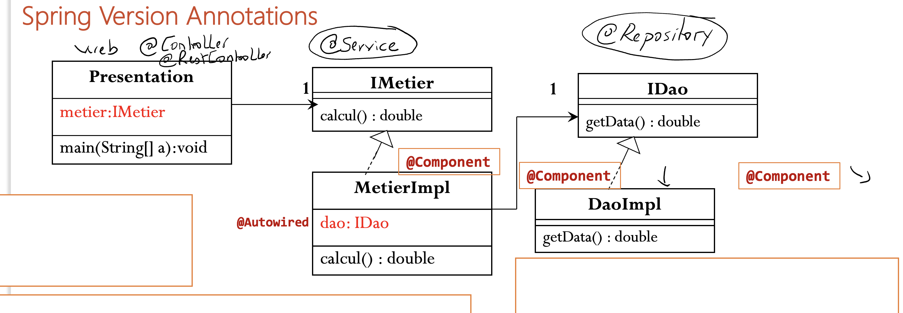
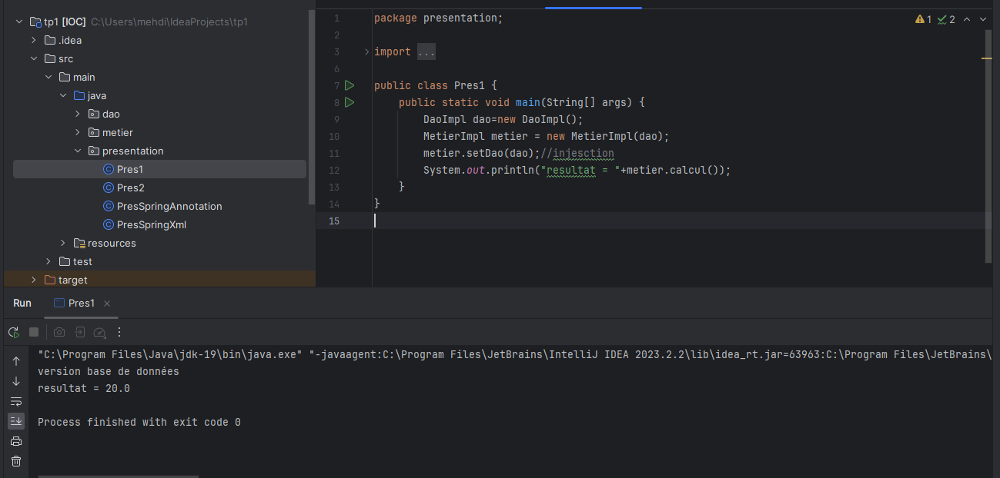
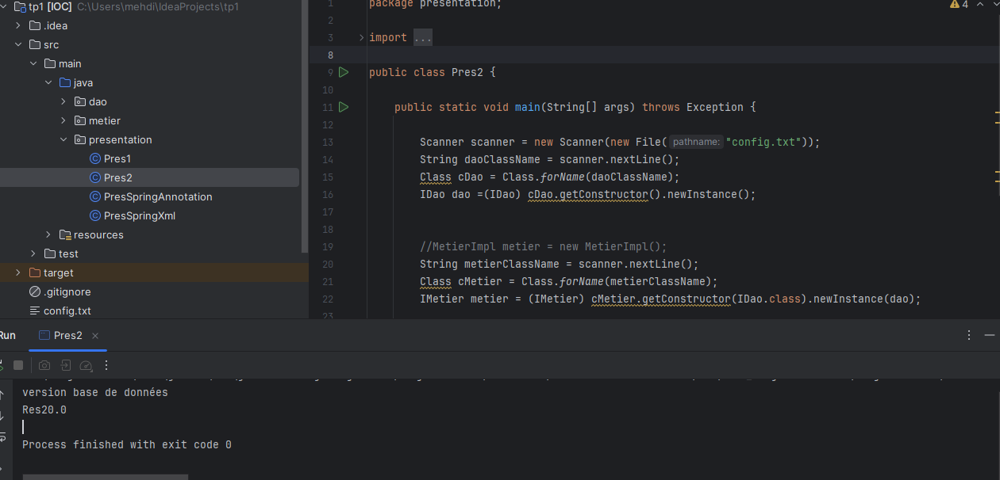
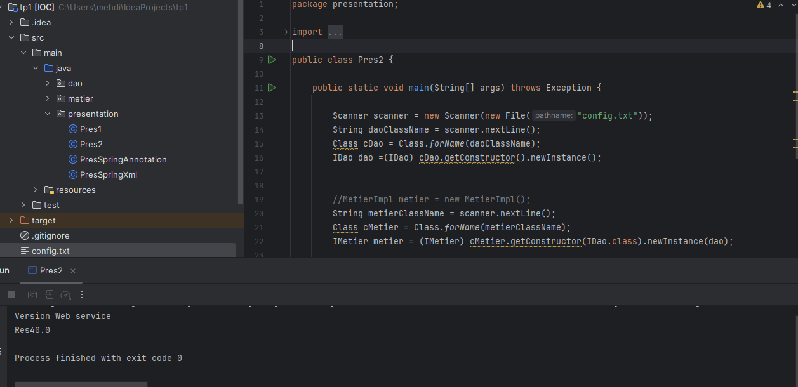
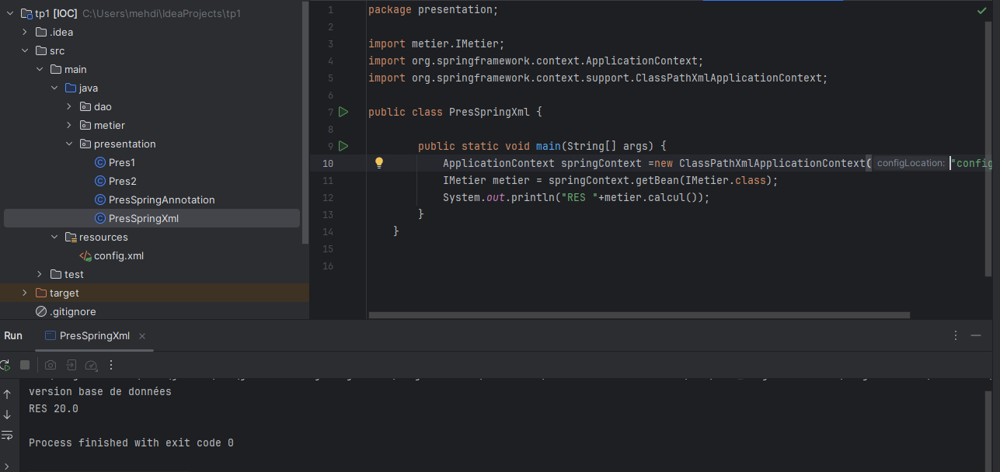
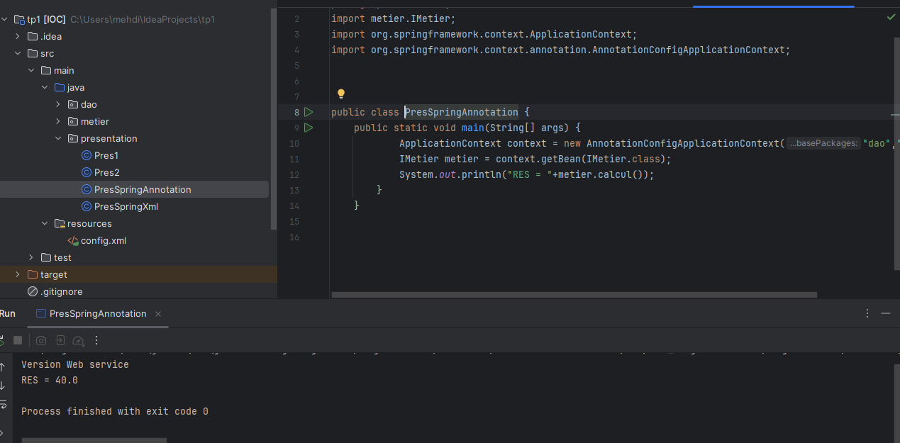

<h1>Report on Inversion of Control and Dependency Injection</h1>
<h2>Introduction</h2>

Inversion of Control (IoC) is a process that allows specifying the dependencies of an object without requiring their direct creation. With IoC, the creation of objects is managed by a container, such as Spring, which handles the injection of beans by connecting them to each other to satisfy all their dependencies.

This helps the developer to focus on the business part of the application.

Spring takes care of dependency injection and all technical features.

<h2>Statement</h2>
<ol>
    <li>DAO Layer
        <ul>
            <li>Create the IDao interface</li>
            <li>Create an implementation of the IDao interface</li>
        </ul>
    </li>
    <li>Business Layer
        <ul>
            <li>Create the IMetier interface</li>
            <li>Create an implementation of the IMetier interface</li>
        </ul>
    </li>
    <li>Presentation Layer
        
Create an application that allows dependency injection.

        <ul>
            <li>Static Instantiation</li>
            <li>Dynamic Instantiation</li>
            <li>Using Spring Framework
                <ul>
                    <li>XML version</li>
                    <li>Annotation version</li>
                </ul>
            </li>
        </ul>
    </li>
</ol>
<h2>Design</h2>
<h3>Principle of Loose Coupling</h3>

To use loose coupling, we need to use interfaces.
Consider a class DaoImpl that implements the IDao interface and a class MetierImpl that implements the IMetier interface.

If the MetierImpl class is associated with the IDao interface, it is said that the MetierImpl class and the IDaoImpl class are linked by loose coupling.

This means that the MetierImpl class can work with any class that implements the IDao interface.
In fact, the MetierImpl class only knows the IDao interface. Therefore, any class implementing this
interface can be associated with the MetierImpl class without the need to modify anything in the
MetierImpl class.

With loose coupling, we can create applications that are closed to modification and open to
extension.

<h3>Presentation 1 Static Instantiation</h3>

<h3>Presentation 2 Dynamic Instantiation, Database Version</h3>

<h3>Presentation 2 Dynamic Instantiation, Web Service Version</h3>

<h3>Presentation Spring XML</h3>

<h3>Presentation Spring Annotation</h3>

